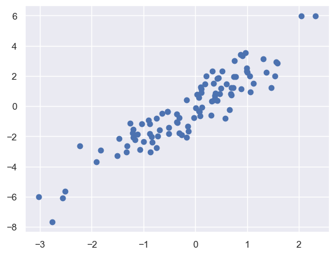
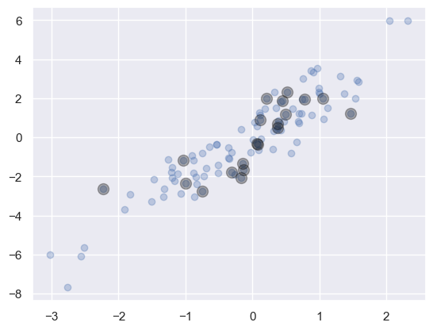
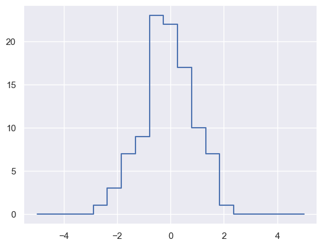
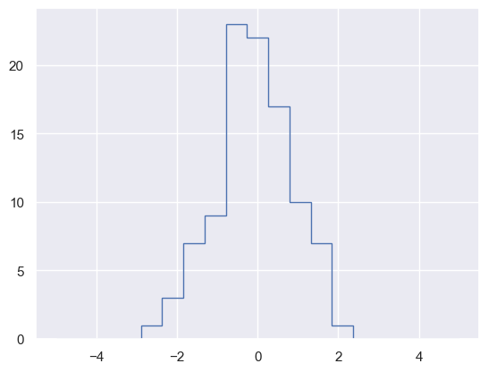

# Fancy_Indexing

```python
import numpy as np

rand = np.random.RandomState(42)
x = rand.randint(100, size=10)
print("x: ", x)

# 한 번에 여러 배열 요소에 접근하기 위해 인덱스 배열을 전달
print("\n[x[3], x[7], x[2]]: ", [x[3], x[7], x[2]])
ind = [3, 7, 4]
print("x[ind]: ", x[ind])

# 결과의 형상은 인덱스 배열의 형상을 반영
ind = np.array([[3, 7], [4, 5]])
print("\nx[ind]: \n", x[ind])

# 다차원에서의 동작
x = np.arange(12).reshape((3, 4))
print("\nx:\n", x)
row = np.array([0, 1, 2])
col = np.array([2, 1, 3])
print("\nrow: ", row, "  col: ", col)
print("\nx[row, col]: ", x[row, col])

# 반환값은 브로드캐스팅된 인덱스 형상 반영
print("\nx[row[:, np.newaxis], col]:\n", x[row[:, np.newaxis], col])
print("\nrow[:, np.newaxis] * col:\n", row[:, np.newaxis] * col)
```

    x:  [51 92 14 71 60 20 82 86 74 74]
    
    [x[3], x[7], x[2]]:  [71, 86, 14]
    x[ind]:  [71 86 60]
    
    x[ind]: 
     [[71 86]
     [60 20]]
    
    x:
     [[ 0  1  2  3]
     [ 4  5  6  7]
     [ 8  9 10 11]]
    
    row:  [0 1 2]   col:  [2 1 3]
    
    x[row, col]:  [ 2  5 11]
    
    x[row[:, np.newaxis], col]:
     [[ 2  1  3]
     [ 6  5  7]
     [10  9 11]]
    
    row[:, np.newaxis] * col:
     [[0 0 0]
     [2 1 3]
     [4 2 6]]

## 결합 인덱싱 Combined Indexing

```python
print("x:\n", x)

# 팬시 인덱스와 단순 인덱스 결합
print("\nx[2, [2, 0, 1]]:", x[2, [2, 0, 1]])

# 팬시 인덱싱과 슬라이싱 결합
print("\nx[1:, [2, 0, 1]]:\n", x[1:, [2, 0, 1]])

# 팬시 인덱싱과 마스킹 결합
mask = np.array([True, False, True, False])
print("\nx[row[:, np.newaxis], mask]:\n", x[row[:, np.newaxis], mask])
```

    x:
     [[ 0  1  2  3]
     [ 4  5  6  7]
     [ 8  9 10 11]]
    
    x[2, [2, 0, 1]]: [10  8  9]
    
    x[1:, [2, 0, 1]]:
     [[ 6  4  5]
     [10  8  9]]
    
    x[row[:, np.newaxis], mask]:
     [[ 0  2]
     [ 4  6]
     [ 8 10]]

## Example: 임의의 점 선택

```python
# NxD 행렬 --> D차원에 N개 점 표시
mean = [0, 0]
cov = [[1, 2],
       [2, 5]]
X = rand.multivariate_normal(mean, cov, 100)
X.shape
```

    (100, 2)

```python
%matplotlib
inline
import matplotlib.pyplot as plt
import seaborn;

seaborn.set()  # 플롯 스타일 설정

plt.scatter(X[:, 0], X[:, 1]);
```



```python
# 임의의 점 20개 선택 --> 원본 배열의 일부 선택
indices = np.random.choice(X.shape[0], 20, replace=False)
print("indices:", indices)
selection = X[indices]  # 팬시 인덱싱 사용
print("selection.shape:", selection.shape)
```

    indices: [69 43 72 13 89  9 37 98 94  4 66 71 52 65 61 59 79 75 27  6]
    selection.shape: (20, 2)

```python
plt.scatter(X[:, 0], X[:, 1], alpha=0.3)
plt.scatter(selection[:, 0], selection[:, 1], facecolor='black', s=100, alpha=0.3);
```



## 팬시 인덱싱으로 값 변경

```python
# 인덱스 배열의 특정 값 변경
x = np.arange(10)
i = np.array([2, 1, 8, 4])
x[i] = 99
print("x:", x)
x[i] -= 10
print("x:", x)
```

    x: [ 0 99 99  3 99  5  6  7 99  9]
    x: [ 0 89 89  3 89  5  6  7 89  9]

```python
x = np.zeros(10)
x[[0, 0]] = [4, 6]  # 4가 할당된 후 6이 할당
print("x:", x)
i = [2, 3, 3, 4, 4, 4]  # [0, 0, 0, 0, 0, 0]
x[i] += 1  # 증가가 아닌 할당 --> [1, 1, 1, 1, 1, 1] 이 된 후 인덱스에 값 전달
print("x:", x)

# 인덱스의 값 연산 즉시 적용
x = np.zeros(10)
np.add.at(x, i, 1)  # Ufunc --> reduceat()
print("\nx:", x)
```

    x: [6. 0. 0. 0. 0. 0. 0. 0. 0. 0.]
    x: [6. 0. 1. 1. 1. 0. 0. 0. 0. 0.]
    
    x: [0. 0. 1. 2. 3. 0. 0. 0. 0. 0.]

## Example: 데이터 구간화

```python
np.random.seed(42)
x = np.random.randn(100)

# 직접 히스토그램 계산
bins = np.linspace(-5, 5, 20)
counts = np.zeros_like(bins)

# 각 x에 대한 적절한 구간 찾기
i = np.searchsorted(bins, x)

# 각 구간에 1 더하기
np.add.at(counts, i, 1)

plt.plot(bins, counts, drawstyle='steps');
```



```python
# 위 처럼 직접 계산하지 않고 hist 사용
# --> 
plt.hist(x, bins, histtype='step');
```



```python
# 소규모 데이터에서 시간
%timeit
np.histogram(x, bins)  # 함수사용
%timeit
np.add.at(counts, np.searchsorted(bins, x), 1)  # 직접 계산

# 대규모 데이터에서 시간
x = np.random.randn(1000000)
%timeit
np.histogram(x, bins)
%timeit
np.add.at(counts, np.searchsorted(bins, x), 1)
```

    9.88 µs ± 48.5 ns per loop (mean ± std. dev. of 7 runs, 100,000 loops each)
    6.53 µs ± 7.6 ns per loop (mean ± std. dev. of 7 runs, 100,000 loops each)
    45.7 ms ± 122 µs per loop (mean ± std. dev. of 7 runs, 10 loops each)
    52.3 ms ± 172 µs per loop (mean ± std. dev. of 7 runs, 10 loops each)
    
