# Simple_Line_Plots

```python
%matplotlib
inline
import matplotlib.pyplot as plt

plt.style.use('seaborn-v0_8-whitegrid')
import numpy as np
```

```python
# 그림 인스턴스
fig = plt.figure()
# 축 인스턴스
ax = plt.axes()
```

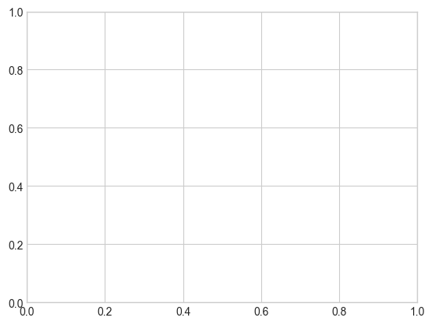

```python
# 간단한 사인 곡선
fig = plt.figure()
ax = plt.axes()

x = np.linspace(0, 10, 1000)
# 데이터 플로팅, 세미콜론은 출력에서 플롯의 텍스트부분 숨김
ax.plot(x, np.sin(x));
```


```python
# 객체지향 인터페이스를 이용한 간단한 사인 곡선
plt.plot(x, np.sin(x));
```


```python
# 여러 줄 중복 플로팅
plt.plot(x, np.sin(x))
plt.plot(x, np.cos(x));
```

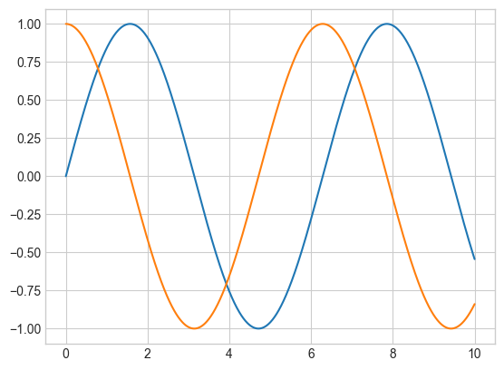

## Adjusting the Plot: Line Colors and Styles

```python
# 플롯 요소의 색상 제어
plt.plot(x, np.sin(x - 0), color='blue')  # 색상을 이름으로 지정 specify color by name
plt.plot(x, np.sin(x - 1), color='g')  # 짧은 색상 코드 short color code (rgbcmyk)
plt.plot(x, np.sin(x - 2), color='0.75')  # 0과 1 사이로 회색조 지정 Grayscale between 0 and 1
plt.plot(x, np.sin(x - 3), color='#FFDD44')  # 16진수 코드 Hex code (RRGGBB from 00 to FF)
plt.plot(x, np.sin(x - 4), color=(1.0, 0.2, 0.3))  # RGB tuple, values 0 to 1
plt.plot(x, np.sin(x - 5), color='chartreuse');  # 모든 HTML 색상 이름을 지원 all HTML color names supported
```

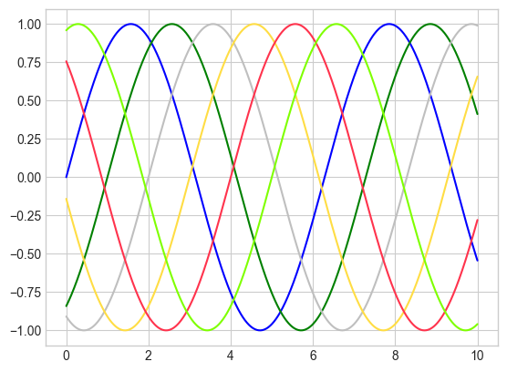

```python
# 라인 스타일 제어
plt.plot(x, x + 0, linestyle='solid')
plt.plot(x, x + 1, linestyle='dashed')
plt.plot(x, x + 2, linestyle='dashdot')
plt.plot(x, x + 3, linestyle='dotted');

# 축약형 코드 For short, you can use the following codes:
plt.plot(x, x + 4, linestyle='-')  # solid
plt.plot(x, x + 5, linestyle='--')  # dashed
plt.plot(x, x + 6, linestyle='-.')  # dashdot
plt.plot(x, x + 7, linestyle=':');  # dotted
```

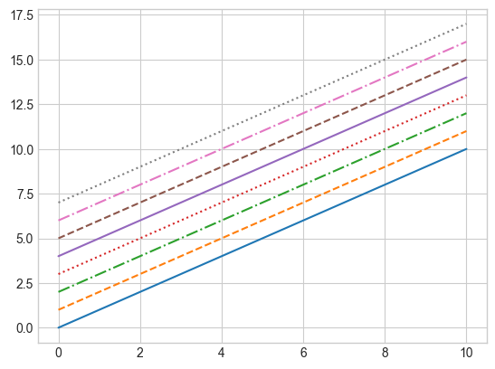

```python
# 간단한 구문으로 색상과 스타일 제어
plt.plot(x, x + 0, '-g')  # solid green
plt.plot(x, x + 1, '--c')  # dashed cyan
plt.plot(x, x + 2, '-.k')  # dashdot black
plt.plot(x, x + 3, ':r');  # dotted red
```

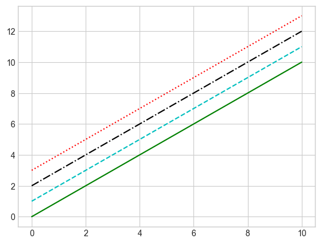

## Adjusting the Plot: Axes Limits

```python
plt.plot(x, np.sin(x))
# 축 경계 조정
plt.xlim(-1, 11)
plt.ylim(-1.5, 1.5);
```

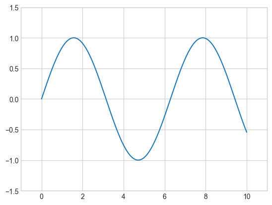

```python
plt.plot(x, np.sin(x))
# 축 하나를 역으로 표시 --> 인수 순서를 바꿈
plt.xlim(10, 0)
plt.ylim(1.2, -1.2);
```

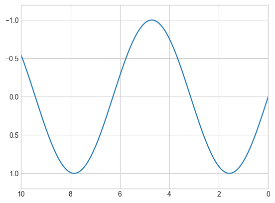

```python
plt.plot(x, np.sin(x))
# 한 번의 호출로 x와 y축의 경계 설정
plt.axis([-1, 11, -1.5, 1.5]);
```


```python
plt.plot(x, np.sin(x))
# 현재 플롯 주변 경계 밀착
plt.axis('tight');
```

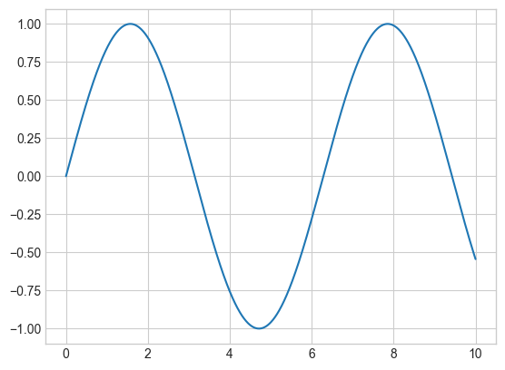

```python
plt.plot(x, np.sin(x))
# x와 y축 단위 통일
plt.axis('equal');
```

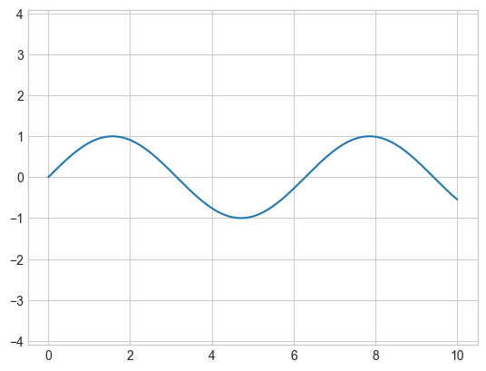

## Labeling Plots

```python
plt.plot(x, np.sin(x))
# 축 레이블과 제목
plt.title("A Sine Curve")
plt.xlabel("x")
plt.ylabel("sin(x)");
```

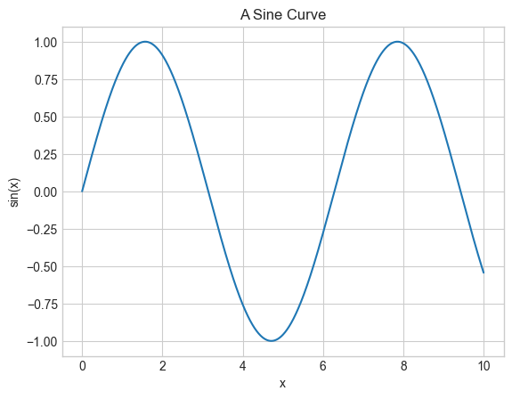

```python
plt.plot(x, np.sin(x), '-g', label='sin(x)')
plt.plot(x, np.cos(x), ':b', label='cos(x)')
plt.axis('equal')
# 플롯 범례 생성
plt.legend();
```

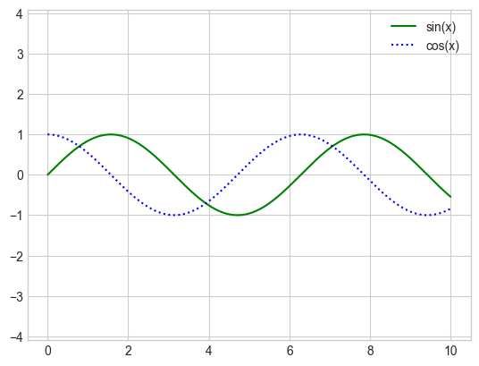

## Aside: Matplotlib Gotchas 주의사항

매트랩 스타일 함수와 객체지향 메서드 사이에서 전환

- ``plt.xlabel()``  → ``ax.set_xlabel()``
- ``plt.ylabel()`` → ``ax.set_ylabel()``
- ``plt.xlim()``  → ``ax.set_xlim()``
- ``plt.ylim()`` → ``ax.set_ylim()``
- ``plt.title()`` → ``ax.set_title()``

```python
ax = plt.axes()
ax.plot(x, np.sin(x))
# 모든 속성을 한 번에 설정
ax.set(xlim=(0, 10), ylim=(-2, 2),
       xlabel='x', ylabel='sin(x)',
       title='A Simple Plot');
```

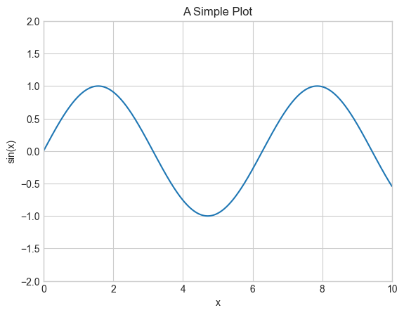
    

