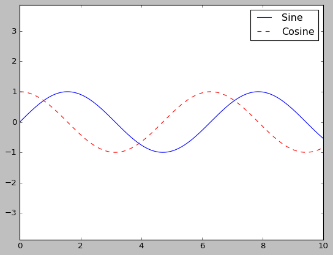
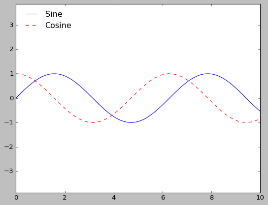
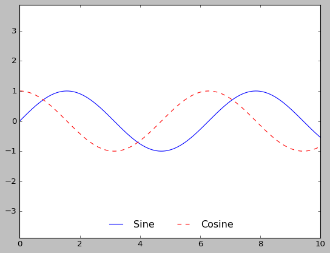
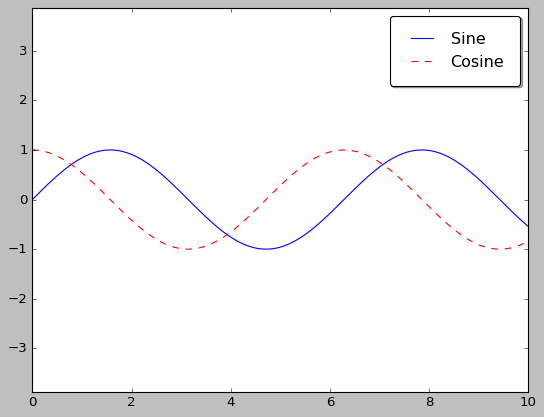
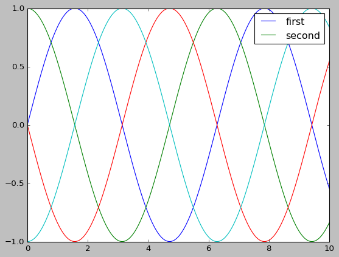
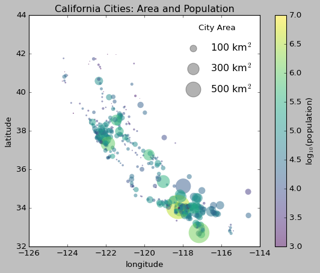
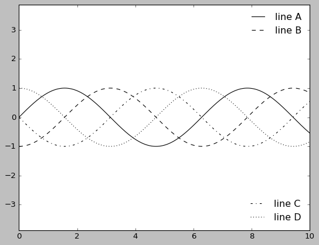

# Customizing Plot Legends

```python
import matplotlib.pyplot as plt

plt.style.use('classic')
%matplotlib
inline
import numpy as np
```

```python
# 기본 플롯 범례
x = np.linspace(0, 10, 1000)
fig, ax = plt.subplots()
ax.plot(x, np.sin(x), '-b', label='Sine')
ax.plot(x, np.cos(x), '--r', label='Cosine')
ax.axis('equal')
leg = ax.legend();
```



```python
# 테두리 제거 위치 지정
ax.legend(loc='upper left', frameon=False)
fig
```



```python
# 열 개수 지정
ax.legend(frameon=False, loc='lower center', ncol=2)
fig
```



```python
# 둥근 모서리 박스 테두리
ax.legend(fancybox=True, framealpha=1, shadow=True, borderpad=1)
fig
```



## Choosing Elements for the Legend

```python
# 범례 요소의 맞춤 설정
y = np.sin(x[:, np.newaxis] + np.pi * np.arange(0, 2, 0.5))
lines = plt.plot(x, y)

# lines is a list of plt.Line2D instances
plt.legend(lines[:2], ['first', 'second']);
```



```python
# 플롯 요소에 레이블 적용
plt.plot(x, y[:, 0], label='first')
plt.plot(x, y[:, 1], label='second')
plt.plot(x, y[:, 2:])
plt.legend(framealpha=1, frameon=True);
```


## Legend for Size of Points

```python
import pandas as pd

cities = pd.read_csv('./california_cities.csv')

# 관심 데이터 추출 Extract the data we're interested in
lat, lon = cities['latd'], cities['longd']
population, area = cities['population_total'], cities['area_total_km2']

# 레이블은 없지만 크기와 색상을 사용해 점을 뿌림
# Scatter the points, using size and color but no label
plt.scatter(lon, lat, label=None,
            c=np.log10(population), cmap='viridis',
            s=area, linewidth=0, alpha=0.5)
plt.gca().set_aspect('equal')
plt.xlabel('longitude')
plt.ylabel('latitude')
plt.colorbar(label='log$_{10}$(population)')
plt.clim(3, 7)

# 범례 생성 Here we create a legend:
# 원하는 크기와 레이블로 빈 리스트 플로팅
# we'll plot empty lists with the desired size and label
for area in [100, 300, 500]:
    plt.scatter([], [], c='k', alpha=0.3, s=area,
                label=str(area) + ' km$^2$')
plt.legend(scatterpoints=1, frameon=False, labelspacing=1, title='City Area')

plt.title('California Cities: Area and Population');
```



## Multiple Legends

```python
fig, ax = plt.subplots()

lines = []
styles = ['-', '--', '-.', ':']
x = np.linspace(0, 10, 1000)

for i in range(4):
    lines += ax.plot(x, np.sin(x - i * np.pi / 2),
                     styles[i], color='black')
ax.axis('equal')

# 첫 번째 범례의 라인과 레이블을 지정
# specify the lines and labels of the first legend
ax.legend(lines[:2], ['line A', 'line B'],
          loc='upper right', frameon=False)

# 두 번째 범례를 만들고 직접 아티스트를 추가
# Create the second legend and add the artist manually.
from matplotlib.legend import Legend

leg = Legend(ax, lines[2:], ['line C', 'line D'],
             loc='lower right', frameon=False)
ax.add_artist(leg);
```


    

