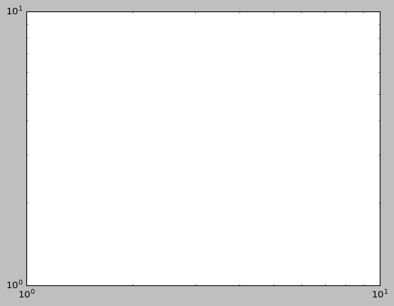
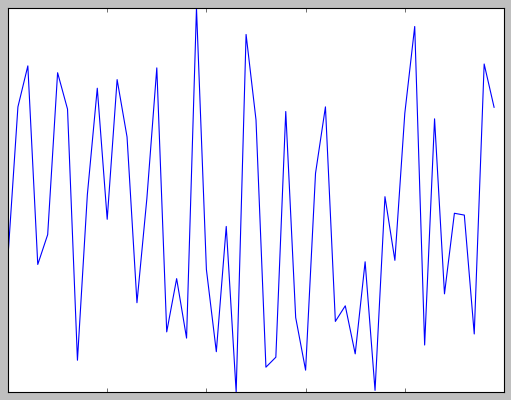
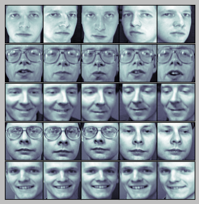
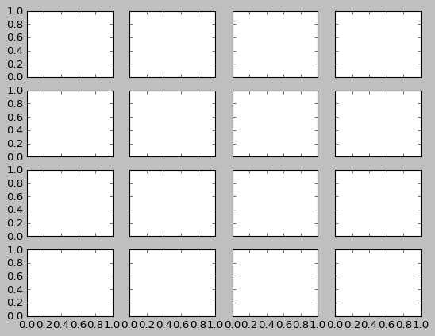
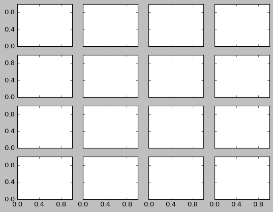
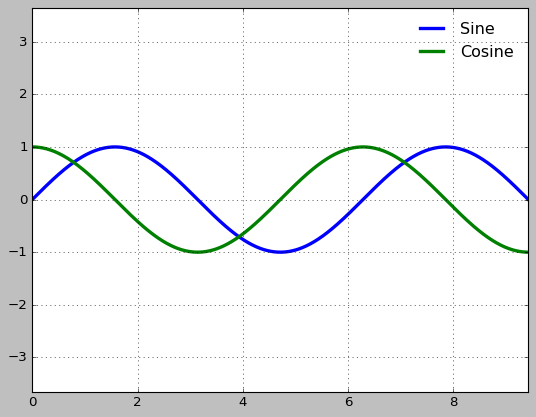
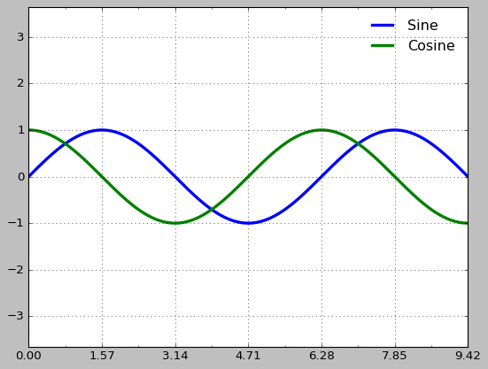
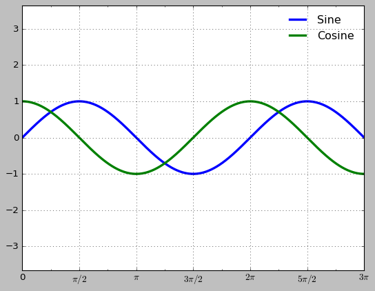

# Customizing_Ticks

## Major and Minor Ticks

```python
import matplotlib.pyplot as plt

plt.style.use('classic')
%matplotlib
inline
import numpy as np
```

```python
ax = plt.axes(xscale='log', yscale='log')
ax.grid();
```



```python
print(ax.xaxis.get_major_locator())
print(ax.xaxis.get_minor_locator())
print(ax.xaxis.get_major_formatter())
print(ax.xaxis.get_minor_formatter())
```

    <matplotlib.ticker.LogLocator object at 0x00000248AA1C4170>
    <matplotlib.ticker.LogLocator object at 0x00000248AA350D10>
    <matplotlib.ticker.LogFormatterSciNotation object at 0x00000248AA351160>
    <matplotlib.ticker.LogFormatterSciNotation object at 0x00000248AA264BF0>

## Hiding Ticks or Labels

```python
ax = plt.axes()
ax.plot(np.random.rand(50))

ax.yaxis.set_major_locator(plt.NullLocator())
ax.xaxis.set_major_formatter(plt.NullFormatter())
```



```python
fig, ax = plt.subplots(5, 5, figsize=(5, 5))
fig.subplots_adjust(hspace=0, wspace=0)

# Get some face data from scikit-learn
from sklearn.datasets import fetch_olivetti_faces

faces = fetch_olivetti_faces().images

for i in range(5):
    for j in range(5):
        ax[i, j].xaxis.set_major_locator(plt.NullLocator())
        ax[i, j].yaxis.set_major_locator(plt.NullLocator())
        ax[i, j].imshow(faces[10 * i + j], cmap="bone")
```



## Reducing or Increasing the Number of Ticks

```python
fig, ax = plt.subplots(4, 4, sharex=True, sharey=True)
```



```python
# 모든 축에 대해 x와 y의 주 눈금의 위치 지시자를 설정
# For every axis, set the x and y major locator
for axi in ax.flat:
    axi.xaxis.set_major_locator(plt.MaxNLocator(3))
    axi.yaxis.set_major_locator(plt.MaxNLocator(3))
fig
```



## Fancy Tick Formats

```python
# Plot a sine and cosine curve
fig, ax = plt.subplots()
x = np.linspace(0, 3 * np.pi, 1000)
ax.plot(x, np.sin(x), lw=3, label='Sine')
ax.plot(x, np.cos(x), lw=3, label='Cosine')

# Set up grid, legend, and limits
ax.grid(True)
ax.legend(frameon=False)
ax.axis('equal')
ax.set_xlim(0, 3 * np.pi);
```



```python
ax.xaxis.set_major_locator(plt.MultipleLocator(np.pi / 2))
ax.xaxis.set_minor_locator(plt.MultipleLocator(np.pi / 4))
fig
```



```python
def format_func(value, tick_number):
    # find number of multiples of pi/2
    N = int(np.round(2 * value / np.pi))
    if N == 0:
        return "0"
    elif N == 1:
        return r"$\pi/2$"
    elif N == 2:
        return r"$\pi$"
    elif N % 2 > 0:
        return r"${0}\pi/2$".format(N)
    else:
        return r"${0}\pi$".format(N // 2)


ax.xaxis.set_major_formatter(plt.FuncFormatter(format_func))
fig
```



## Summary of Formatters and Locators

### 위치 지시자

 Locator class        | Description                       | EngDescription                                          
----------------------|-----------------------------------|---------------------------------------------------------
 ``NullLocator``      | 눈금이 없음                            | No ticks                                                
 ``FixedLocator``     | 눈금 위치가 고정됨                        | Tick locations are fixed                                
 ``IndexLocator``     | 인덱스 플롯을 위한 위치 지시자                 | Locator for index plots (e.g., where x = range(len(y))) 
 ``LinearLocator``    | min 부터 max 까지 일정한 간격을 두고 눈금을 위치시킴 | Evenly spaced ticks from min to max                     
 ``LogLocator``       | min 부터 max 까지 로그 단위로 눈금을 위치시킴     | Logarithmically ticks from min to max                   
 ``MultipleLocator``  | 눈금과 범위가 기본값의 배수                   | Ticks and range are a multiple of base                  
 ``MaxNLocator``      | 눈금 최대 숫자에 맞게 적절한 위치를 찾음           | Finds up to a max number of ticks at nice locations     
 ``AutoLocator``      | 간단한 기본값을 가지는 MaxNLocator          | (Default.) MaxNLocator with simple defaults.            
 ``AutoMinorLocator`` | 보조 눈금에 대한 위치 지시자                  | Locator for minor ticks                                 

### 서식 지시자

 Formatter Class        | Description        | EngDescription                          
------------------------|--------------------|-----------------------------------------
 ``NullFormatter``      | 눈금 레이블이 없음         | No labels on the ticks                  
 ``IndexFormatter``     | 레이블 목록에서 문자열을 설정   | Set the strings from a list of labels   
 ``FixedFormatter``     | 레이블에 직접 문자열을 설정    | Set the strings manually for the labels 
 ``FuncFormatter``      | 사용자 정의 함수가 레이블을 설정 | User-defined function sets the labels   
 ``FormatStrFormatter`` | 각 값에 대한 포맷 문자열을 사용 | Use a format string for each value      
 ``ScalarFormatter``    | 스칼라값에 대한 포맷 지시자    | (Default.) Formatter for scalar values  
 ``LogFormatter``       | 로그 축에 대한 기본 포맷 지시자 | Default formatter for log axes          
